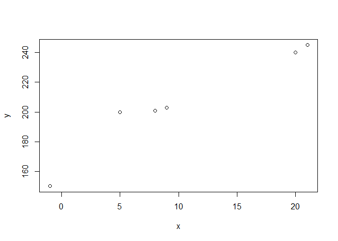

R markdown essai
================
2026-04-24

This is a line from Rstudio.

``` r
## insert your brilliant WORKING code here
x = c(-1,5,8,9,20,21)
y = c(150,200,201,203,240,245)
plot(x, y)
```

<!-- -->
